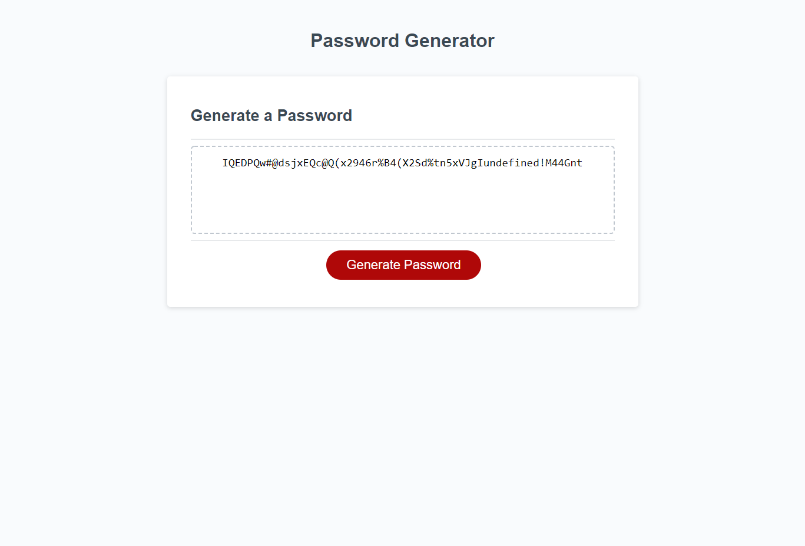

# DESCRIPTION:

Website that generates a randomized password depending on user input. The user can decide how many characters the password has, and what kind of character they would like to have in the password.

# SCREENSHOT

# DEPLOYED APPLICATION

https://seeker-09.github.io/Password-Generator/